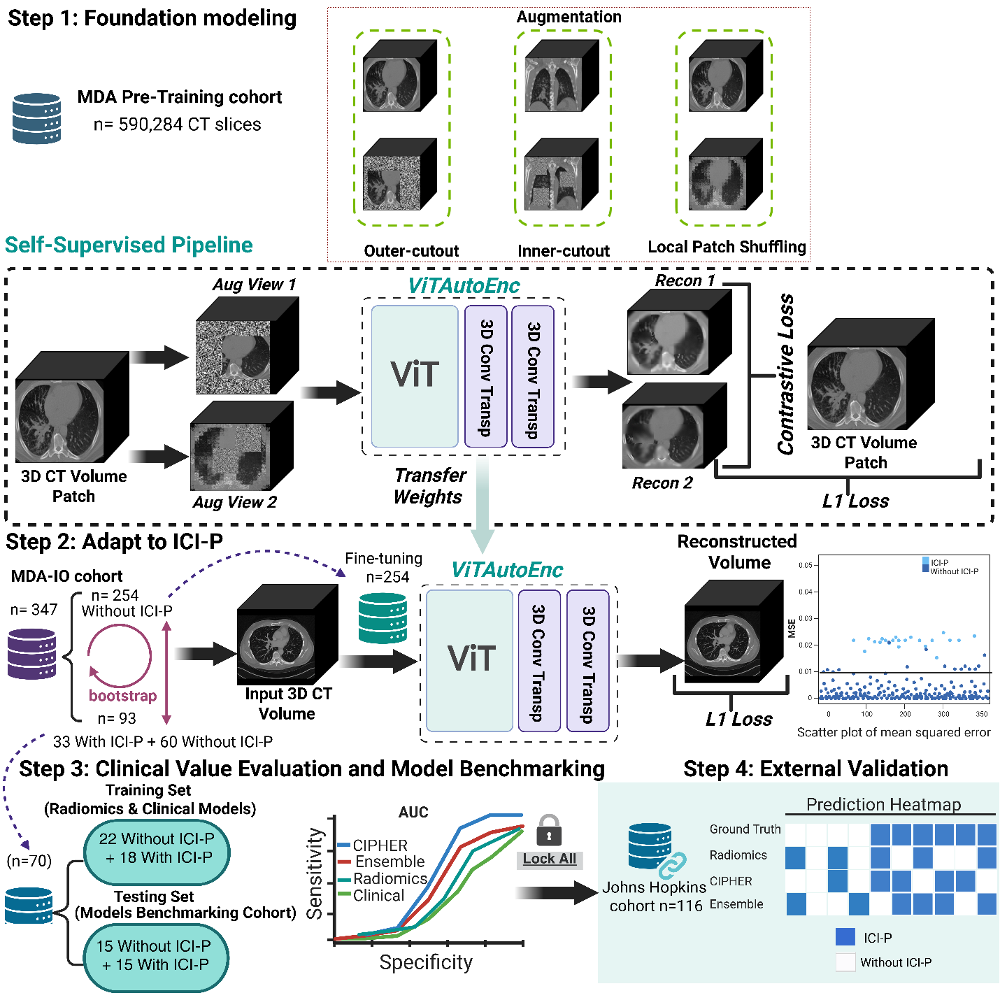
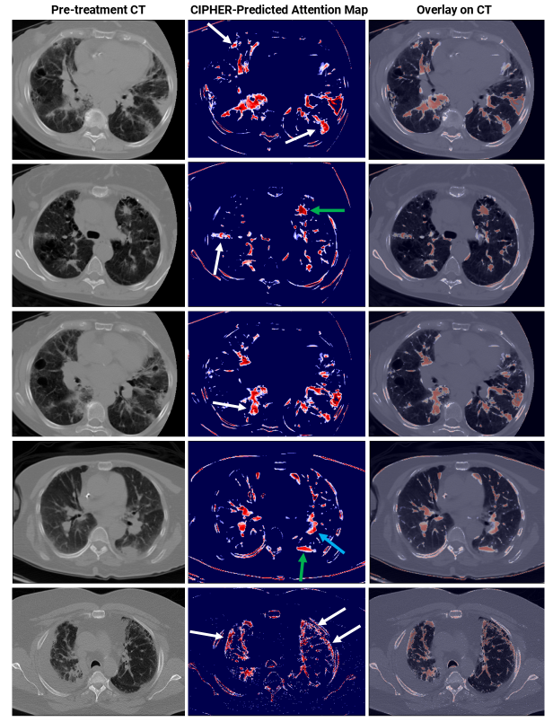

# CIPHER: CT-Based Deep Foundation Model for Predicting Immune Checkpoint Inhibitor-Induced Pneumonitis Risk

**CIPHER** (**C**heckpoint-**I**nhibitor **P**neumonitis **H**azard **E**stimato**R**) is a CT-based deep foundation model designed to estimate the risk of immune checkpoint inhibitor-induced pneumonitis (ICI-P) before treatment initiation in patients with lung cancer. CIPHER uses self-supervised learning to learn intrinsic lung-parenchymal representations from baseline chest CT imaging and generates a reconstruction-derived imaging risk score for patient-level risk stratification.



## Key Features

- **Pretreatment ICI-P Risk Prediction:** Estimates ICI-P risk directly from baseline chest CT scans before immune checkpoint inhibitor therapy.
- **Large-Scale Foundation-Model Pretraining:** Developed using 590,284 axial CT slices from 4,242 CT scans representing 2,500 patients with non-small cell lung cancer.
- **Self-Supervised Transformer Architecture:** Uses a 3D Swin Transformer encoder with rotation prediction, contrastive representation learning, and image reconstruction objectives.
- **Reconstruction-Derived Risk Score:** Uses reconstruction error within the segmented lung volume as a quantitative imaging biomarker rather than a conventional supervised binary-classification output.
- **Internal and External Validation:** Evaluated in an internal MD Anderson cohort and independently validated in a Johns Hopkins cohort.
- **Interpretable Risk Localization:** Model-derived heatmaps highlight pulmonary regions contributing to elevated predicted risk, including clinically relevant interstitial and parenchymal patterns.

## Study Cohorts

| Cohort | Purpose | Patients / Scans | ICI-P Cases |
|---|---|---:|---:|
| Lung cancer foundation-model cohort | Self-supervised pretraining | 2,500 patients / 4,242 CT scans | Not required |
| Internal immunotherapy cohort | Fine-tuning and internal evaluation | 347 patients | 33 |
| Internal held-out cohort | Five-run internal evaluation | 93 patients | 33 |
| Johns Hopkins cohort | Independent external validation | 116 patients | 20 |

## Results

- **Internal evaluation:** CIPHER achieved AUCs ranging from **0.77 to 0.85** across five internal subsampling runs.
- **External validation:** CIPHER achieved an **AUC of 0.83** and **balanced accuracy of 81.7%** in the independent Johns Hopkins cohort.
- **External sensitivity and specificity:** Sensitivity was **80.0%** and specificity was **83.3%**.
- **Case-level performance:** CIPHER correctly identified **16 of 20 ICI-P cases** and **80 of 96 non-ICI-P cases** in the external cohort.
- **Benchmarking:** CIPHER outperformed the clinical and radiomics comparator models in external testing and maintained a favorable balance between sensitivity and specificity.
- **Interpretability:** Heatmaps localized pulmonary regions associated with elevated risk, including subpleural reticulation, ground-glass opacity, and other baseline parenchymal abnormalities.



## Repository Structure

```text
CIPHER/
├── README.md
├── RELEASE_CHECKLIST.md
├── requirements.txt
├── .gitignore
├── assets/
│   ├── Fig_1.png
│   └── Fig_2.png
├── pretraining/
│   ├── __init__.py
│   ├── train.py
│   ├── config.py
│   ├── models/
│   │   ├── __init__.py
│   │   └── ssl_head.py
│   ├── losses/
│   │   ├── __init__.py
│   │   └── ssl_loss.py
│   ├── optimizers/
│   │   ├── __init__.py
│   │   └── lr_scheduler.py
│   ├── utils/
│   │   ├── __init__.py
│   │   ├── augmentations.py
│   │   └── data.py
│   ├── configs/
│   │   └── pretrain.yaml
│   ├── jsons/
│   │   └── SwinUNETRPretraining.example.json
│   └── scripts/
│       └── run_pretraining.sh
└── fine_tuning/
    └── README.md
```

## Installation

### 1. Clone the repository

```bash
git clone https://github.com/WuLabMDA/CIPHER.git
cd CIPHER
```

Change the URL above if the final repository is hosted under a different organization or repository name.

### 2. Create an environment

```bash
python -m venv .venv
source .venv/bin/activate
python -m pip install --upgrade pip
```

Install a CUDA-compatible PyTorch build for your system, then install the remaining dependencies:

```bash
pip install -r requirements.txt
```

## Data Preparation

CIPHER pretraining uses a MONAI Decathlon-style JSON data list. Each entry must point to a volumetric CT image, such as a NIfTI file.

Example:

```json
{
  "training": [
    {"image": "data/pretraining/train/patient_0001.nii.gz"},
    {"image": "data/pretraining/train/patient_0002.nii.gz"}
  ],
  "validation": [
    {"image": "data/pretraining/validation/patient_0101.nii.gz"}
  ]
}
```

Copy and edit the provided example:

```bash
cp pretraining/jsons/SwinUNETRPretraining.example.json \
   pretraining/jsons/SwinUNETRPretraining.json
```

Absolute paths may be used directly. For relative paths, set `data_root` in the YAML configuration.

## Self-Supervised Pretraining

### Configuration

Edit:

```text
pretraining/configs/pretrain.yaml
```

The provided configuration reproduces the settings supplied with the original source code, including:

- 3D input patches of `96 × 96 × 96`
- batch size of `4`
- two random crops per input volume
- AdamW optimizer
- learning rate of `6 × 10⁻⁶`
- 500 warmup steps followed by cosine decay
- 300 epochs
- rotation, contrastive, and L1 reconstruction losses
- random block masking and cross-sample block replacement

### Single-GPU training

```bash
python -m pretraining.train \
    --config pretraining/configs/pretrain.yaml
```

### Multi-GPU training

The original training setup used four distributed GPU processes. Run:

```bash
NPROC_PER_NODE=4 bash pretraining/scripts/run_pretraining.sh
```

A different configuration file can be supplied as the first argument:

```bash
NPROC_PER_NODE=4 bash pretraining/scripts/run_pretraining.sh \
    pretraining/configs/pretrain.yaml
```

### TensorBoard

```bash
tensorboard --logdir outputs/pretraining
```

### Main Outputs

```text
outputs/pretraining/
├── model_best_reconstruction.pt
├── model_final.pt
├── final_model_state_dict.pth
└── events.out.tfevents.*
```

## Fine-Tuning and Risk Scoring

The manuscript uses a separate task-specific stage after foundation-model pretraining:

1. Fine-tune the reconstruction model using internal non-ICI-P cases.
2. Calculate reconstruction error within the segmented lung volume.
3. Aggregate reconstruction error to a patient-level CIPHER risk score.
4. Select and lock the classification threshold using internal development data.
5. Apply the locked model and threshold without retraining to internal held-out and external validation cohorts.

The executable fine-tuning scripts were not included in the source files used to prepare this repository package. The `fine_tuning/` directory therefore contains a documentation placeholder and should be replaced with the final fine-tuning, inference, lung-masking, risk-aggregation, and thresholding code before public release.

## Citation

If you use CIPHER, please cite the associated work. The publication information should be updated after the final article is published.

```bibtex
@unpublished{Muneer2026CIPHER,
  title  = {{CT}-Based Deep Foundation Model for Predicting Immune Checkpoint Inhibitor-Induced Pneumonitis Risk in Lung Cancer},
  author = {Muneer, Amgad and Showkatian, Eman and Kitsel, Yuliya and Saad, Maliazurina B. and Sujit, Sheeba J. and Soto, Felipe and Shroff, Girish S. and Faiz, Saadia A. and Ghanbar, Mohammad I. and Ismail, Sherif M. and Vokes, Natalie I. and Cascone, Tina and Le, Xiuning and Zhang, Jianjun and Byers, Lauren A. and Jaffray, David and Chang, Joe Y. and Liao, Zhongxing and Naing, Aung and Gibbons, Don L. and Vaporciyan, Ara A. and Heymach, John V. and Suresh, Karthik S. and Altan, Mehmet and Sheshadri, Ajay and Wu, Jia},
  year   = {2026},
  note   = {Manuscript under review}
}
```

## Intended Use

This repository is provided for research and reproducibility. CIPHER is not a cleared medical device and should not be used for clinical decision-making without prospective validation and appropriate regulatory review.

## Contact

For questions, contributions, or issues, please open a GitHub issue or contact the corresponding research team.
